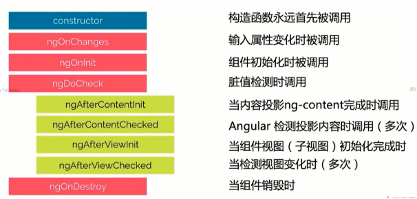
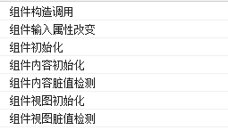

**脏值检测**：检测内部状态变化
**内容投影**：Content组件内嵌套的内容
**组件视图**：
DoCheck和OnChanges的功能类似，一般不在同一个组件中使用
AfterViewInit可以确保获取渲染完成的组件属性

```JavaScript
export class TestComponent implements OnInit, OnChanges, AfterContentInit {
  constructor() {
    console.log('组件构造调用');
  }
  /**
 * 组件的@Input 属性变化后调用
 * @param changes 索引对象
 */
  ngOnChanges(changes: SimpleChanges): void {
    console.log('组件输入属性改变');
  }
  ngOnInit(): void {
    console.log("组件初始化");
  }
  ngAfterContentInit(): void {
    console.log('组件内容初始化');
  }
  ngAfterContentChecked(): void {
    console.log('脏值检测');
  }
  ngAfterViewInit(): void {
    console.log('组件视图初始化');
  }
  ngAfterViewChecked(): void {
    console.log('组件视图脏值检测');
  }
}
```
运行结果

